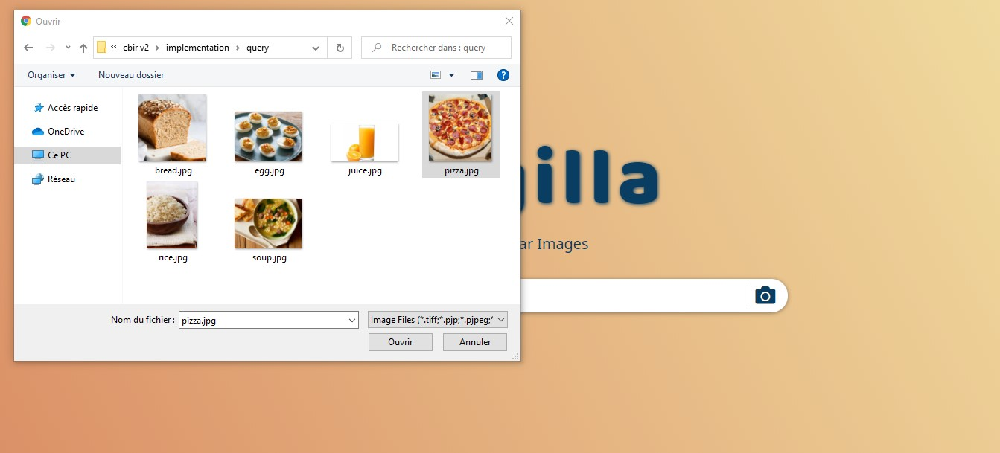
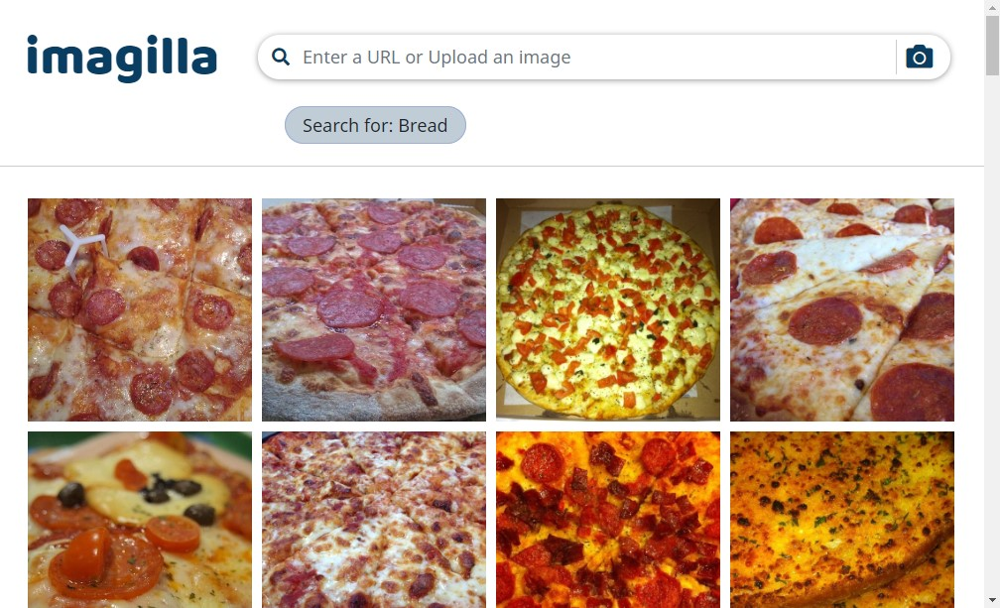
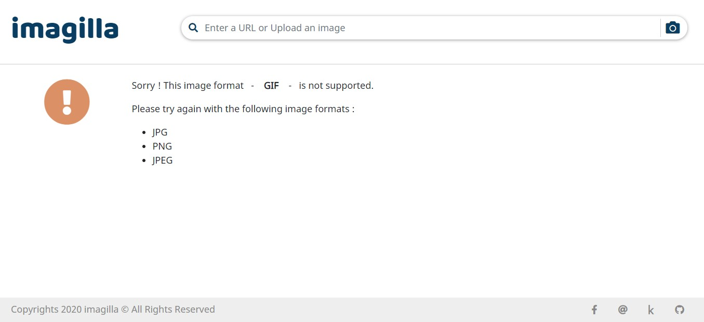

# Imagilla

Ce projet vise à développer un moteur de recherche d'images en donnant une requête, des images similaires seront récupérées à partir d'une grande base de données. Il est basé sur l'apprentissage en profondeur qui est un domaine de l'apprentissage automatique fusionné avec quelques nouveaux concepts qui ont gagné un grand intérêt au cours des dernières années, l'apprentissage par transfert et les algorithmes de recherche des voisins les plus proches.

Technologies utilisées pour ce projet :

- HTML & CSS
- Bootstrap
- Django
- PostgreSQL
- Tensorflow
- Keras
- Annoy
- Cloudinary CDN

Les fichiers nécessaires à l'algorithme de deep learning peuvent être téléchargés ici : [Kaggle notebook - output files](https://www.kaggle.com/code/yassou432/clustercbir-01-reduced-featsize/data).

L'algorithme complet est écrit en : ```algo/Model Building using Transfer Learning.ipynb```

## Installation

Suivez ces étapes pour installer le dépôt :

```cmd
git clone https://github.com/YassouSr/imagilla.git
cd imagilla
python -m venv env
.\env\Scripts\activate
python -m pip install -r requirement.txt
```

Ensuite, téléchargez les fichiers nécessaires pour l'algorithme à partir du lien fourni ci-dessus ou exécutez le script de l'algorithme et enregistrer les résultats dans le dossier ```models/```, puis exécutez l'application.

```cmd
python manage.py runserver
```

## Interface utilisateur graphique

### Page d'accueil

Cette page permet aux utilisateurs d'effectuer une recherche en téléchargeant une image depuis leur machine ou en saisissant une URL d'image valide.


### Page de recherche

Une fois que l'utilisateur a téléchargé une image ou saisi l'URL d'image, l'application renvoi 96 ​​images similaires à la requête, en fonction de la classe prédite de la requête. Comme indiqué ci-dessous, l'application a prédit la classe de requête ```pizza``` et a renvoyé des échantillons similaires.





### Page d'erreur

L'application Web dirigera l'utilisateur vers cette page chaque fois qu'il entrera un format d'image invalide ou une URL invalide.


