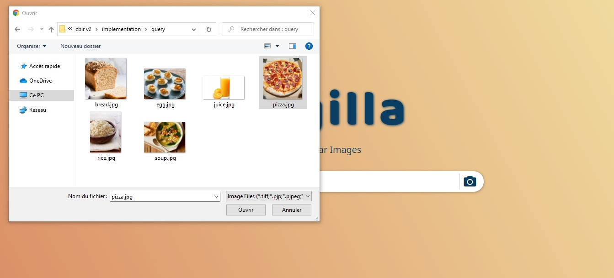
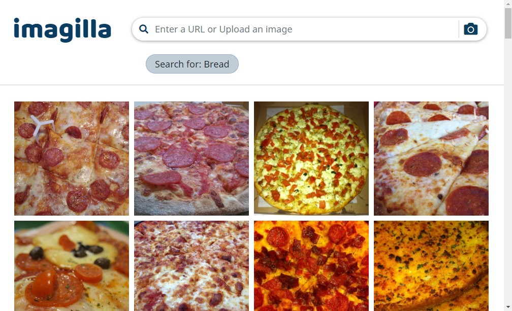

# Imagilla

This project aims to develop an image search application by giving a query image, similar images will be retrieved from a large database. It is based on deep learning which is a field of machine learning merged with a couple of new concepts that have gained a large interest in the last few years, transfer learning and approximate nearest neighbors search algorithms.

Technologies used for this project :

- HTML & CSS
- Bootstrap
- Django
- PostgreSQL
- Tensorflow
- Keras
- Annoy
- Cloudinary CDN

The necessary files for deep learning algorithm can be downloaded here : [Kaggle notebook - output files](https://www.kaggle.com/code/yassou432/clustercbir-01-reduced-featsize/data).

The full algorithm is written in : ```algo/Model Building using Transfer Learning.ipynb```

## Installation

Follow these steps to install the repo :

```cmd
git clone https://github.com/YassouSr/imagilla.git
cd imagilla
python -m venv env
.\env\Scripts\activate
python -m pip install -r requirement.txt
```

Then either download the necessary files for the algorithm from the link provided above or run the script of algorithm and store the results inside ```models/``` folder, after that execute the application.

```cmd
python manage.py runserver
```

## Graphical User Interface

### Home Page

This page enables users to search by uploading an image from their machine or entering a valid image URL.


### Search Page

After the user uploads an image or enters an image URL, our application will return 96 similar images to the query, based on the query predicted class. As shown below the application predicted the query class - pizza - and returned similar samples.





### Error Page

Our web app will direct the user to this page whenever he or she enters an invalid image format or an invalid URL.


